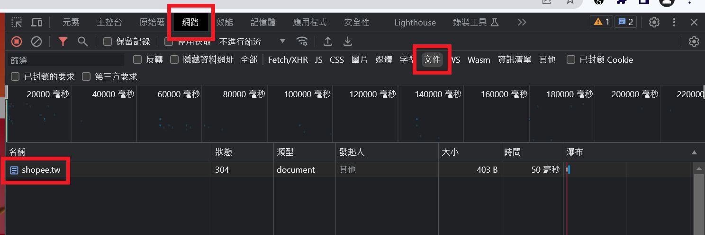
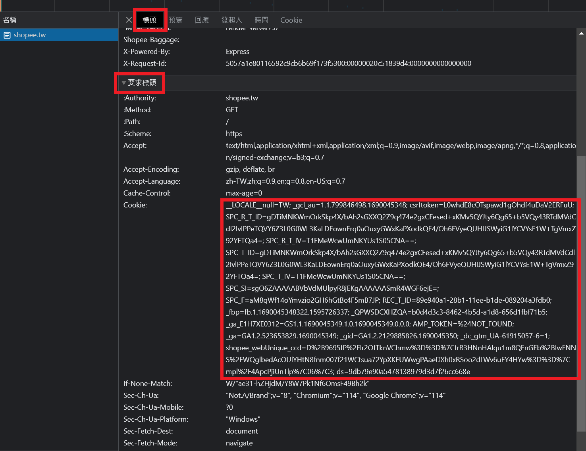

# 如何取得 Cookie

以下示範用中文版的 Google Chrome。

1. 用瀏覽器開無痕。
2. 登入你的蝦皮帳號。建議用帳號密碼，但用第三方登入應該也是可以（沒仔細研究）。然後回到官網[首頁](https://shopee.tw)。
3. 按 F12 打開開發者工具，選「網路」頁籤，再選「文件」子頁籤。然後按 F5 重新整理。

   

4. 點選 shopee.tw 項目，選「標頭」標籤，再找到「要求標頭」，然後找到「Cookie」項目。

   

5. 複製 cookie，如上圖大紅框。Cookie 是敏感資訊，不要外流；上圖沒有打馬賽克是因為我沒有登入。
6. 將 cookie 貼到一個檔案中。注意 cookie 只會有一行。把檔案存起來。
